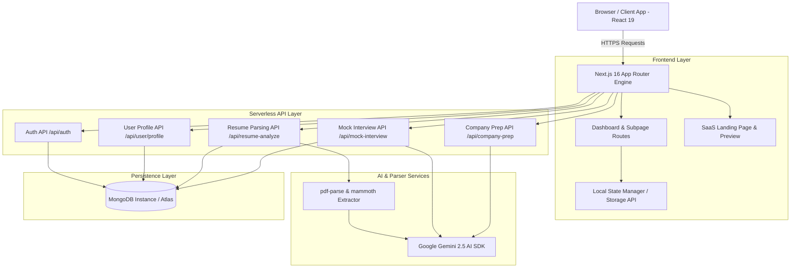

# 🏛️ Technical Architecture - PlacementAI

This document provides an in-depth overview of the system architecture, data flow, component hierarchy, database models, and AI engine integration of **PlacementAI**.

---

## 🗺️ High-Level System Architecture



---

## 📦 System Component Layers

### 1. Presentation & UI Layer (`src/app`)
- **Next.js 16 App Router**: Uses React 19 server components and interactive client components (`"use client"`).
- **Glassmorphism Design System**: Built with CSS variable design tokens (`src/app/globals.css`) for surface elevation, glowing borders, dark mode palettes, and responsive grid layouts.
- **Iconography & Animation**: Powered by `lucide-react` icons and Framer Motion CSS keyframes.

### 2. API & Serverless Backend (`src/app/api`)
- **RESTful Endpoints**: Built using Next.js `Route Handlers` (`route.ts`).
- **Multipart Document Processing**: Handles incoming `FormData` streams containing PDF, Word (`.docx`), or plain text files without saving raw files to disk.
- **Fail-Safe Fallbacks**: Implements automatic heuristic generation if API keys or database connections are temporarily unconfigured.

### 3. AI Intelligence Engine (`@google/genai`)
- Implements structured JSON prompting with Google Gemini 2.5 Flash model.
- Analyzes candidate resumes against job descriptions to compute ATS match scores, missing keywords, and section-by-section improvements.
- Evaluates candidate mock interview answers against STAR criteria (Situation, Task, Action, Result) with score breakdown and feedback.

### 4. Database & Persistence Layer (`src/models` & `src/lib/mongodb.ts`)
- **Serverless Connection Cache**: Uses cached Mongoose connection pattern (`cached.conn`) to optimize serverless cold starts.
- **Mongoose Schemas**:
  - `User`: Handles email, password hash, user profile details, target company, and solved DSA problem IDs.
  - `ATSReport`: Stores timestamped ATS resume scans, keyword matches, and score trends.
  - `MockInterview`: Records practice sessions, question categories, user responses, and AI feedback ratings.

---

## 🗄️ Database Schemas

### User Schema (`src/models/User.ts`)
```typescript
interface IUser {
  name: string;
  email: string;
  passwordHash?: string;
  targetCompany?: string;
  targetRole?: string;
  solvedDSA?: string[]; // Array of solved problem IDs
  createdAt: Date;
  updatedAt: Date;
}
```

### ATS Report Schema (`src/models/ATSReport.ts`)
```typescript
interface IATSReport {
  userId: string;
  fileName: string;
  matchScore: number;
  matchedKeywords: string[];
  missingKeywords: string[];
  suggestedImprovements: string[];
  jobTitle?: string;
  createdAt: Date;
}
```

---

## 🔒 Security Architecture

1. **Password Hashing**: Passwords hashed using `bcryptjs` with 10 salt rounds prior to storage.
2. **Stateless JWT Authorization**: Tokens signed with `jsonwebtoken` (`JWT_SECRET`) returned upon successful sign-in.
3. **Hydration Protection**: SSR/CSR state synchronization prevents client-side React hydration mismatches.
4. **Environment Isolation**: Sensitive keys (`GEMINI_API_KEY`, `MONGODB_URI`, `JWT_SECRET`) strictly maintained in `.env.local` and excluded from version control.
